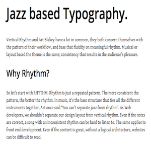
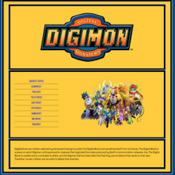

# latest-work

|[Thermostatic](https://github.com/Mervodactyl/thermostat_front_and_back)|[Blakey](https://github.com/Mervodactyl/blakey)|[ScssyDigimon](https://github.com/Mervodactyl/scssyDigimon)|
|--- |--- |--- |
| A Thermostat App built from scratch (front and back end) using Jasmine testing framework, vanilla JavaScript, JQuery, and CSS3/HTML | A Vertical Rhythm experiment explaining the importance of including the practice in Web Design, and  the commonalities it has with Jazz | Built in SCSS, JQuery and JSON; using various mixins, variables and formulas. The content is based around the attributes of Digimon |
||||

## For more details about me and my work please visit my  [CV](https://github.com/Mervodactyl/CV) repository
